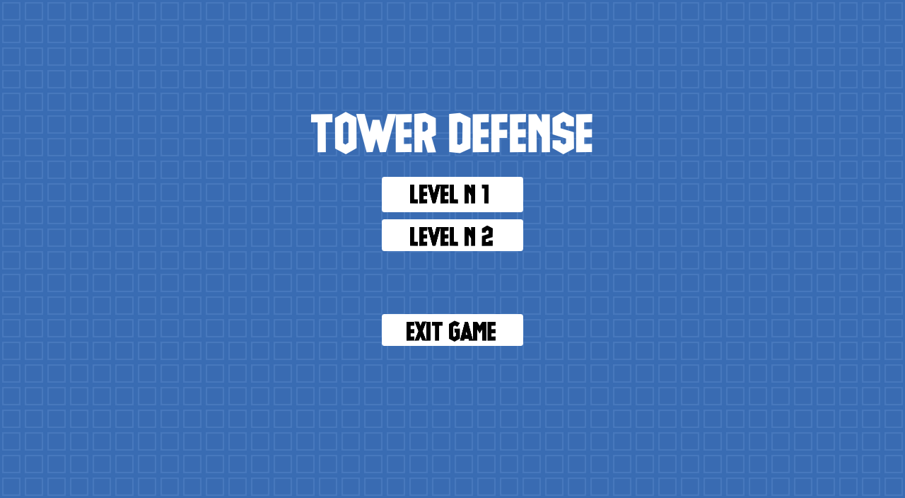
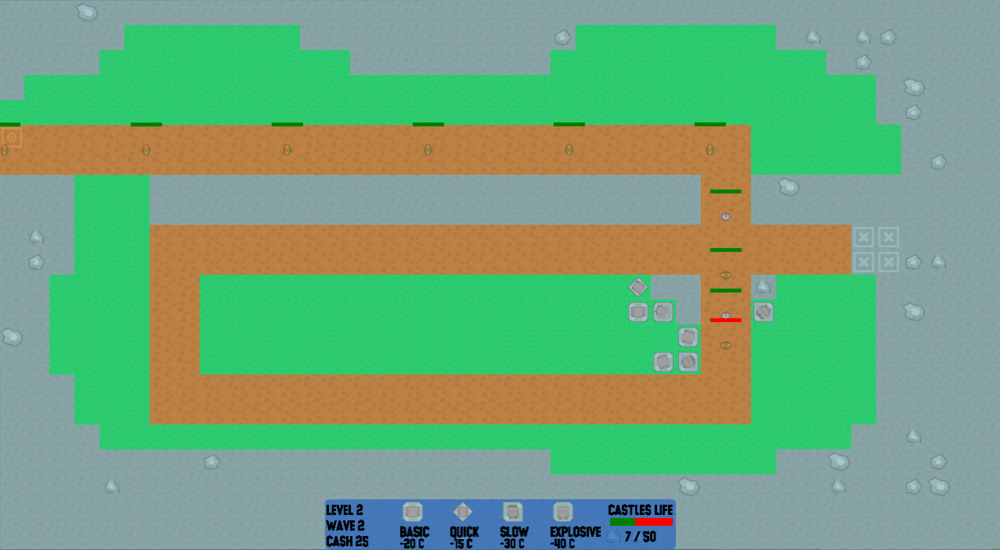

Tower Defense
===============
This is a top-down 2D tower defense game written in C++ using only GLFW and ImGui.

Description
-----------
`Tower Defense c++` is a top-down 2D tower defense game written in standard C++ using only GLFW and ImGui libraries. 
`Tower Defense c++` has been tested on Windows 10 only.

### Petri
Petri is the combination of Perrochaud and Trier.
We am not a professional game developer yet, nor a professional C++ programmer yet, so the design may be unconventional or sub-optimal in many ways.

Asset Credits
-------------
- Sprites : https://www.kenney.nl/assets/tower-defense-top-down
- Font : https://www.dafont.com/glue-gun.font
